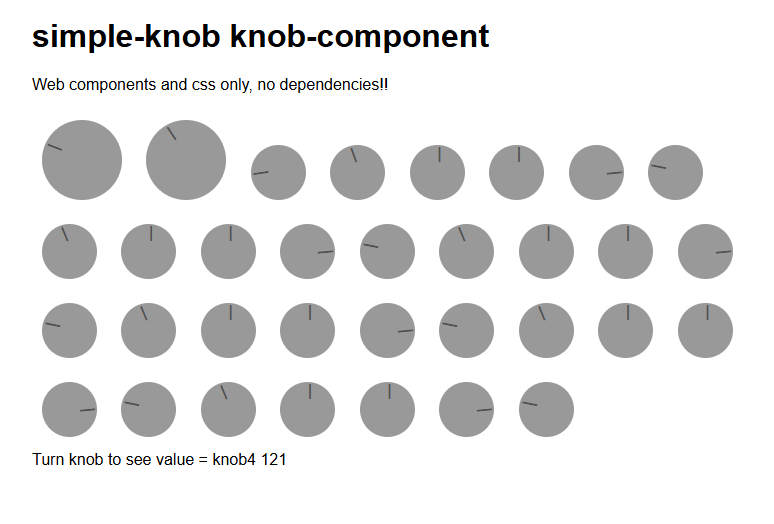

# simple-knob
Simple Vanilla Javascript Web Component and CSS based knob

Web components and css only, no dependencies!!

[](https://nigelskeels.github.io/simple-knob/)

Demo Here..
https://nigelskeels.github.io/simple-knob/


Import the component
```
<script type="module" src="knob-component.js"></script>
```

Use the component
```
<knob-component id="knob1" value="100"></knob-component>
```

Add some extra parameters
```
<knob-component id="knob1" style="height:80px!important;width:80px!important;" value="0" min="0" max="500" offsetangle="180" title="Bigger Knob"></knob-component>

```

Adding a listener for value changes
```
  var el = document.getElementsByTagName("knob-component")[0]
  document.addEventListener('knobuievent', function (ev) { 
          console.log("knobuievent",ev.detail) 
  }, false);
```
